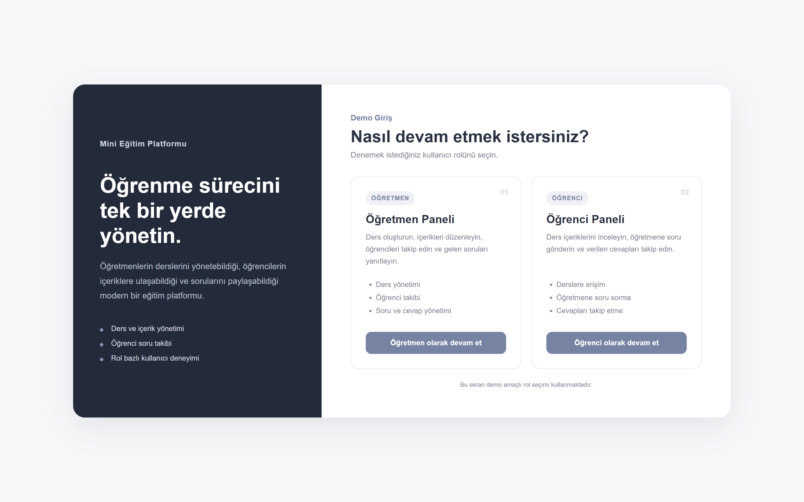
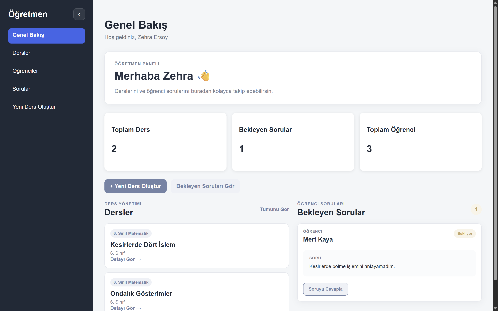
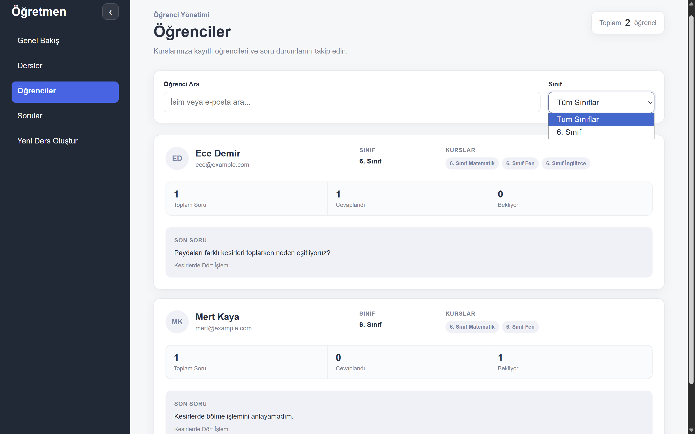
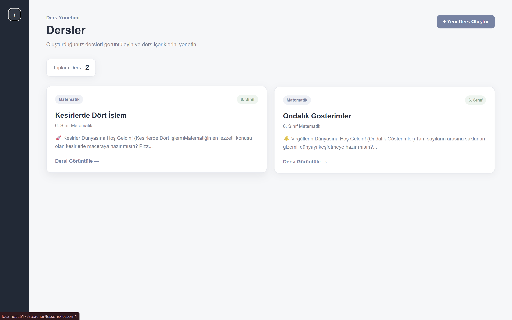
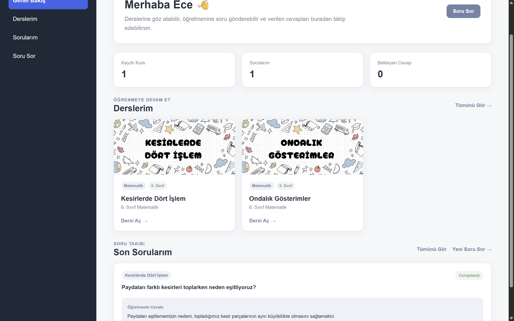

# Mini Eğitim Platformu

Öğretmen ve öğrenciler için geliştirilmiş, rol tabanlı bir eğitim yönetim platformu.

Proje; öğretmenlerin ders içerikleri oluşturabilmesini, öğrencilerini ve sorularını yönetebilmesini, öğrencilerin ise kayıtlı oldukları dersleri görüntüleyip öğretmenlerine soru sorabilmesini sağlayan full-stack bir web uygulamasıdır.

> Bu proje öğrenme, portföy geliştirme ve gerçek dünya web uygulaması mimarisini deneyimleme amacıyla geliştirilmiştir.

## Live Demo

[Uygulamayı Canlı Görüntüle](https://mini-egitim-platformu.vercel.app/)

> Demo giriş ekranından öğretmen veya öğrenci rolü seçilebilir.

---
## Ekran Görüntüleri

### Giriş Ekranı



### Öğretmen Dashboard



### Öğrenci Yönetimi



### Ders Detayı



### Öğrenci Dashboard



---

## Özellikler


### Öğretmen

- Öğretmen dashboard'u
- Ders oluşturma, düzenleme ve görüntüleme
- Rich-text ders içeriği oluşturma
- Derslere kapak görseli yükleme
- Öğrenci listesini görüntüleme
- Öğrencilerin kayıtlı olduğu dersleri görüntüleme
- Öğrenci soru istatistiklerini görüntüleme
- Bekleyen soruları cevaplama
- Ders ve soru yönetimi

### Öğrenci

- Öğrenci dashboard'u
- Sadece kayıtlı olduğu dersleri görüntüleme
- Ders detaylarını görüntüleme
- Ders hakkında soru gönderme
- Gönderdiği soruları ve durumlarını takip etme
- Öğretmen cevaplarını görüntüleme

### Genel

- Öğretmen ve öğrenci için ayrı uygulama akışları
- Role-based protected routes
- Responsive masaüstü, tablet ve mobil tasarım
- REST API entegrasyonu
- PostgreSQL ilişkisel veri modeli
- Backend validation ve authorization kontrolleri
- Frontend ve backend otomatik testleri
- Merkezi hata yönetimi

---

## Kullanılan Teknolojiler

### Frontend

- React
- TypeScript
- Vite
- React Router
- TipTap
- DOMPurify
- CSS

### Backend

- Node.js
- Express
- TypeScript
- Prisma ORM
- PostgreSQL
- Multer

### Testing

- Vitest
- React Testing Library
- Jest DOM
- User Event
- Supertest

---

## Proje Yapısı

```text
mini-egitim-platformu/
│
├── src/
│   ├── components/
│   ├── pages/
│   ├── services/
│   ├── test/
│   └── App.tsx
│
├── server/
│   ├── prisma/
│   │   ├── migrations/
│   │   ├── schema.prisma
│   │   └── seed.ts
│   │
│   └── src/
│       ├── lib/
│       ├── middleware/
│       └── index.ts
│
└── README.md
```

---

## Veri Modeli

Platformun temel veri modeli aşağıdaki yapılar üzerine kuruludur:

- `User`
- `Course`
- `Lesson`
- `Enrollment`
- `Question`
- `Answer`

`Enrollment` modeli sayesinde öğrenciler belirli derslere/kurslara kayıt edilir ve yalnızca kendilerine atanmış içerikleri görüntüleyebilir.

---

## Demo Authentication

Bu projede öğretmen ve öğrenci akışlarını test etmek amacıyla basitleştirilmiş bir demo authentication sistemi kullanılmaktadır.

Kullanıcı seçimi frontend üzerinden yapılır ve seçilen demo kullanıcının kimliği backend'e `x-demo-user-id` header'ı ile gönderilir.

> **Önemli:** Bu authentication yöntemi production kullanımı için uygun değildir.

Gerçek bir production uygulamasında güvenli authentication için örneğin aşağıdaki yaklaşımlar kullanılmalıdır:

- Güvenli kullanıcı giriş sistemi
- Hash'lenmiş şifreler
- Session veya doğrulanmış token sistemi
- Backend tarafında güvenli authorization
- Kaynak sahipliği kontrolleri

Bu projedeki sistemin amacı öğretmen ve öğrenci rollerini, protected route yapısını ve backend authorization mantığını gösterebilmektir.

---

## Kurulum

### 1. Repoyu klonlayın

```bash
git clone https://github.com/fatmazehraersoy/mini-egitim-platformu.git
cd mini-egitim-platformu
```

### 2. Frontend bağımlılıklarını yükleyin

```bash
npm install
```

### 3. Backend bağımlılıklarını yükleyin

```bash
cd server
npm install
```

### 4. Environment variables

`server/.env` dosyası oluşturun.

Örnek environment variable yapısı için:

```text
server/.env.example
```

dosyasını kullanabilirsiniz.

Gerçek API anahtarları veya veritabanı şifreleri GitHub'a eklenmemelidir.

### 5. Prisma işlemleri

Backend klasöründe:

```bash
npx prisma generate
npx prisma migrate dev
npx prisma db seed
```

### 6. Backend'i çalıştırın

```bash
npm run dev
```

Backend varsayılan olarak:

```text
http://localhost:3000
```

adresinde çalışır.

### 7. Frontend'i çalıştırın

Yeni bir terminal açarak proje ana klasöründe:

```bash
npm run dev
```

Frontend Vite development server üzerinden çalışır.

---

## Testing

### Frontend testleri

Proje ana klasöründe:

```bash
npm test -- --run
```

### Backend testleri

```bash
cd server
npm test -- --run
```

Test edilen senaryolardan bazıları:

- Ders kartının doğru başlığı göstermesi
- Boş ders başlığı ile form gönderilememesi
- Öğrencinin öğretmen sayfasına erişememesi
- Backend'in boş soru içeriğini `400 Bad Request` ile reddetmesi
- Role-based authorization kontrolleri

---

## Production Build

Frontend:

```bash
npm run build
```

Backend:

```bash
cd server
npm run build
```

---

## Güvenlik

Ders içerikleri rich-text HTML olarak saklanmaktadır.

Frontend tarafında HTML içerikleri render edilmeden önce `DOMPurify` ile sanitize edilerek güvenli şekilde gösterilir.

Environment dosyaları, yüklenen kullanıcı dosyaları ve oluşturulan Prisma client dosyaları Git tarafından takip edilmez.

---

## Debugging

Geliştirme sırasında aşağıdaki hata senaryoları test edilmiştir:

- Backend servisinin kapalı olması
- Hatalı API URL kullanımı
- `404 Not Found`
- Eksik request body ve `400 Bad Request`
- Yetkisiz rol ve `403 Forbidden`
- PostgreSQL bağlantı hataları
- Eksik environment variable senaryoları

VS Code breakpoint özelliği kullanılarak backend request'lerinin runtime değerleri de incelenmiştir.

Daha ayrıntılı notlar `DEBUG_NOTES.md` dosyasında bulunmaktadır.

---

## Mevcut Sınırlamalar

Bu proje bir portföy ve öğrenme projesidir.

- Authentication sistemi demo amaçlıdır.
- Dosya yükleme sistemi şu anda backend'in yerel dosya sistemi üzerine kuruludur.
- Production ortamı için kalıcı cloud storage entegrasyonu gereklidir.
- AI destekli cevap üretme entegrasyonu üzerinde çalışılmıştır ancak gerçek API kullanımı demo kapsamı dışında bırakılmıştır.

---

## Gelecek Geliştirmeler

- Production authentication sistemi
- Cloud image storage entegrasyonu
- Gelişmiş kullanıcı yönetimi
- Daha kapsamlı test coverage
- AI destekli soru-cevap sistemi
- Deployment ve canlı demo

---

## Proje Durumu

Projenin temel öğretmen ve öğrenci akışları tamamlanmıştır.

Uygulama şu anda portföy sunumu ve deployment aşamasındadır.

